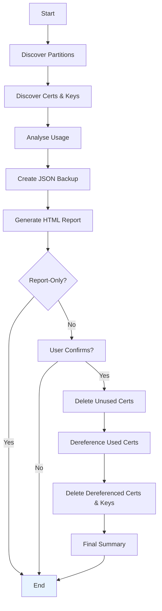

# F5 BIG-IP Certificate Cleanup – **Operational Runbook**

> **Purpose:** Automate discovery, analysis, backup, reporting and safe removal of expired SSL certificates (and keys) across *all* partitions on one or more BIG-IP devices.
>
> **Audience:** Network / Platform Engineers, SREs, Infosec, Change-management approvers.

---

## 1 | Executive Summary

The script `f5_cert_cleanup.py` provides a **zero-downtime** workflow to:  
1. Discover every SSL certificate & key on a BIG-IP, across all partitions.  
2. Analyse usage in 9 object types (profiles, monitors, auth-servers, etc.).  
3. Generate an HTML report (auto-named `f5_cert_cleanup_report_<ip>.html`).  
4. Create a JSON **backup** before *any* deletion (`backup_<ip>.json`).  
5. Safely delete unused certs and **dereference** used ones (swap to partition default /Common/default.crt) before deletion.  
6. Works in **batch mode** for large fleets; produces a consolidated report.

---

## 2 | Key Features

| Capability | Details |
|------------|---------|
| Multi-Partition | Discovers and processes certs/keys in every partition. |
| TLS Adapter | Custom `F5TLSAdapter` ⇒ smart TLS 1.3/1.2 with automatic legacy fallback. |
| JSON Backup | Mandatory backup of cert, key & usage metadata (`backup_<ip>.json`). |
| Auto-Named Reports | Device IP/time-stamped filenames avoid collisions. |
| Interactive or **Report-Only** | Dry validation possible (`--report-only`). |
| Batch Processing | CSV input; parallelisable; single HTML roll-up. |
| Recovery Guide | `RECOVERY_GUIDE.md` gives step-by-step restore instructions. |

---

## 3 | Architecture & Flow



---

## 4 | Installation

```bash
# Clone repo
$ git clone <repo-url>
$ cd f5-cert-logic

# Install Python deps
$ pip install -r requirements.txt  # (requests, urllib3)
```
*
> Optionally create a virtual-env and install the package as editable for CI pipelines.

---

## 5 | Usage Cheat-Sheet

### Single Device
```bash
# Read-only reconnaissance
python f5_cert_cleanup.py \
  --host 192.168.1.100 \
  --username admin \
  --report-only

# Full cleanup (asks for confirmation)
python f5_cert_cleanup.py --host 192.168.1.100 --username admin
```

### Batch Mode
```bash
python f5_cert_cleanup.py --devices-csv devices.csv --username admin
```
`devices.csv` format:
```csv
hostname,ip,username,password
bigip-a,10.0.0.10,admin,
bigip-b,10.0.0.11,svc_user,Secr3t!
```

### Important Flags
| Flag | Default | Description |
|------|---------|-------------|
| `--expiry-days` | 30 | Threshold for *expiring soon* classification |
| `--tls-version` | auto | TLS strategy (`auto`, `legacy`, `tlsv1_2`, etc.) |
| `--ciphers` | None | Custom cipher string |
| `--report-only` | False | Generate reports but **do not** delete anything |

---

## 6 | Backup File Schema

`backup_<ip>.json` contains:
```json
{
  "backup_metadata": {"timestamp":"…","device_ip":"…"},
  "certificates": [ {"name":"…","partition":"…",…} ],
  "usage_information": [
      {"certificate": {"name":"…"},
       "usage_locations": [{"object_type":"Client-SSL Profile",…}]}
  ]
}
```

Store these files off-box (Git, S3, etc.) for audit & recovery.

---

## 7 | Change & Rollback Process

1. **Run with `--report-only`** → attach HTML report to CAB ticket.  
2. Obtain approval → run script in active mode.  
3. **Backups auto-created** – copy to secure storage.  
4. If rollback needed → follow `RECOVERY_GUIDE.md`.

---

## 8 | Permission Requirements

* BIG-IP role: **Administrator** (or custom role with RW to):
  * `tm/sys/file/ssl-*`
  * `tm/ltm/profile/*`, `tm/ltm/monitor/*`
  * `tm/gtm/monitor/https`
  * `tm/apm/profile/authentication`
  * `tm/auth/*`
  * `tm/sys/syslog`

---

## 9 | Known Limitations

* No automatic renewal / ACME integration (see [lets-encrypt-python][le]).
* Pagination not yet handled for > 1000 objects (`rest-pagination`).
* Dry-run flag covers discovery & report; does **not** simulate PATCH/DELETE.
* SSL verification disabled by default – use `--tls-version tlsv1_2 --ciphers …` plus corporate CA bundle for strict mode.

---

## 10 | Next Steps / Road-map

| Priority | Enhancement |
|----------|-------------|
| 🔜 | Implement `--dry-run` flag that logs intended REST calls |
| 🔜 | Add pagination support via `?limit=` and `"nextLink"` cursor |
| 🛡️ | Optional CA-bundle verification & secret-manager creds |
| ⚡ | ThreadPool parallelism for batch processing |
| 📈 | Structured JSON logging (ELK / Splunk friendly) |
| ♻️ | ACME/Let's-Encrypt renewal plugin ([f5devcentral/lets-encrypt-python][le]) |

---

[le]: https://github.com/f5devcentral/lets-encrypt-python "Let's Encrypt for F5" 