# F5 Certificate Cleanup Logic

This document provides a comprehensive technical overview of the F5 Certificate Cleanup script, detailing its architecture, workflow, and core logic components. It is intended for developers and system administrators who need to understand, maintain, or extend the script.

## Table of Contents
1.  [**Overview**](#-overview)
2.  [**Data Models**](#-data-models)
3.  [**High-Level Workflow**](#-high-level-workflow)
4.  [**Certificate Discovery**](#-certificate-discovery-process)
5.  [**Usage Analysis**](#-usage-analysis-logic)
6.  [**Safety Checks**](#-safety-check-system)
7.  [**Certificate Dereferencing**](#-certificate-dereferencing-logic)
8.  [**Certificate Deletion**](#-certificate-deletion-process)
9.  [**Configuration Diff**](#-configuration-diff-generation)
10. [**Advanced Features**](#-advanced-features)
11. [**Execution Phases**](#-execution-phases)
12. [**Key Design Principles**](#-key-design-principles)

---

## 🎯 Overview

> The F5 Certificate Cleanup script is an automated tool designed to safely identify, dereference, and remove expired SSL certificates from F5 BIG-IP devices. It operates across all administrative partitions, handles complex object dependencies, and performs comprehensive safety checks to ensure zero service impact during cleanup operations. Its primary goal is to enhance security posture by automating the lifecycle management of SSL certificates.

---

## 📄 Data Models

The script uses several data classes to structure information during its execution.

### `CertificateInfo`
> Stores all relevant details about a discovered SSL certificate.

-   `name`: The short name of the certificate (e.g., `mycert.crt`).
-   `full_path`: The complete path, including partition (e.g., `/Common/mycert.crt`).
-   `expiration_date`: A `datetime` object representing the expiration date.
-   `days_until_expiry`: An integer indicating the number of days until expiration (negative if expired).
-   `is_expired`: A boolean flag, `True` if the certificate has expired.
-   `is_expiring_soon`: A boolean flag, `True` if the certificate is within the expiry threshold.
-   `subject`: The certificate's subject line.
-   `issuer`: The certificate's issuer.
-   `corresponding_key`: The name of the associated SSL key file (e.g., `mycert.key`).
-   `partition`: The administrative partition where the certificate resides.

### `CertificateUsage`
> Represents a single instance of a certificate being used by an F5 configuration object.

-   `object_type`: The type of F5 object using the certificate (e.g., `Client-SSL Profile`).
-   `object_name`: The name of the F5 object.
-   `object_path`: The full path of the F5 object.
-   `field_name`: The specific field where the certificate is referenced (e.g., `certKeyChain.cert`).
-   `partition`: The partition of the F5 object.

---

## 🔄 High-Level Workflow

> The script follows a structured, multi-phase process to ensure a safe and effective cleanup. It begins with discovery and analysis, proceeds to safety validation, executes the cleanup with user consent, and concludes with comprehensive reporting.

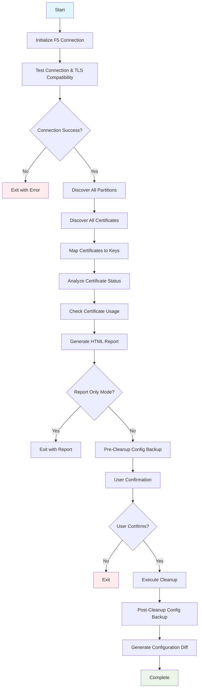

---

## 🔍 Certificate Discovery Process

### Partition Discovery
> To ensure all certificates are found, the script first queries the F5 device to discover all administrative partitions. This allows it to scan beyond the default `Common` partition.

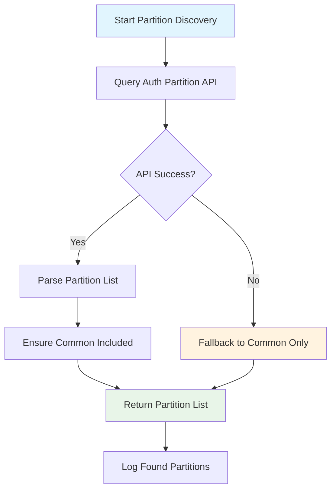

### Certificate and Key Discovery
> For each discovered partition, the script queries for all SSL certificates and keys. It parses certificate metadata, determines its expiration status, and intelligently maps each certificate to its corresponding private key based on common naming conventions.

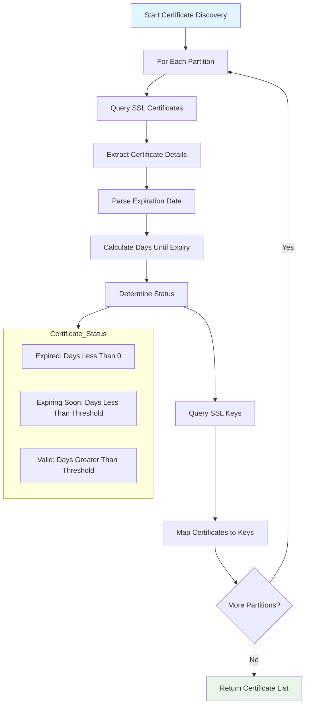

---

## 🔬 Usage Analysis Logic

> This is a critical step where the script determines if a certificate is actively used by any F5 configuration object. The script can operate in two modes: a highly efficient bulk analysis mode or a fallback individual analysis mode.

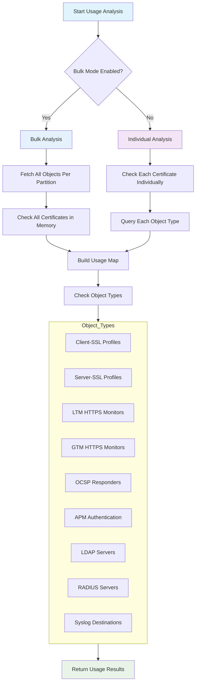

### Partition-Aware API Queries
> All usage analysis queries are partition-aware, using the `$filter=partition eq {partition}` parameter to scope the search. This ensures accurate dependency checking in multi-tenant environments.

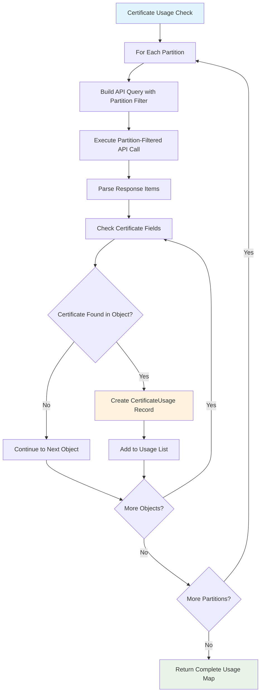

---

## 🛡️ Safety Check System

> Before any destructive operation, the script performs comprehensive safety checks to prevent service impact. It verifies the status of any Virtual Servers or GTM objects associated with the certificate being cleaned up.

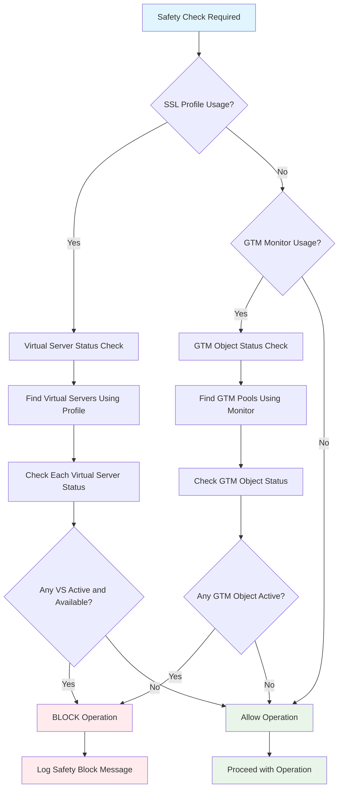

### Virtual Server Status Logic
> The script determines if a Virtual Server is active by checking both its administrative `enabled` state and its operational `availabilityState` via the F5 stats endpoint.

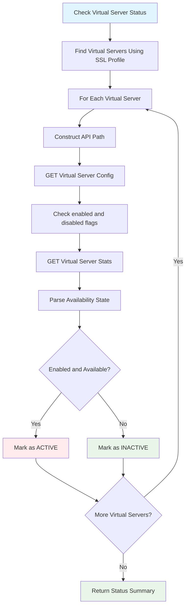

---

## 🔄 Certificate Dereferencing Logic

> The dereferencing process safely replaces an expired certificate with an appropriate default certificate. It uses the correct partition-aware API path (`~Partition~ObjectName`) and modifies the relevant fields based on the object type.

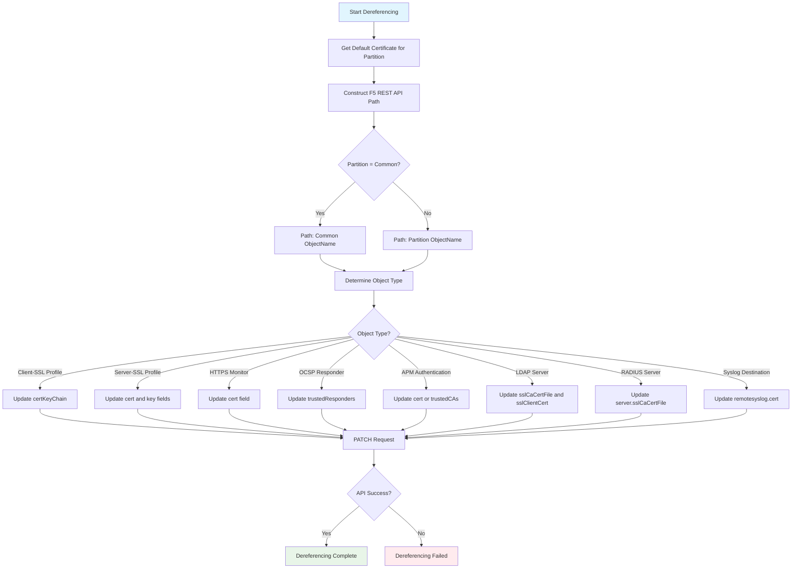

### Default Certificate Resolution
> The script intelligently resolves the correct default certificate to use. It first looks for a `default.crt` in the object's specific partition. If not found, it falls back to using the global `/Common/default.crt`.

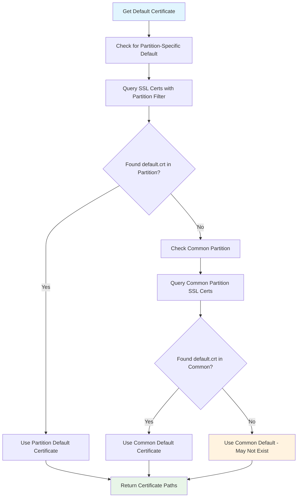

---

## 🗑️ Certificate Deletion Process

> After successful dereferencing, the certificate and its corresponding key are deleted. The script includes a final safety check to prevent accidental deletion of protected default certificates.

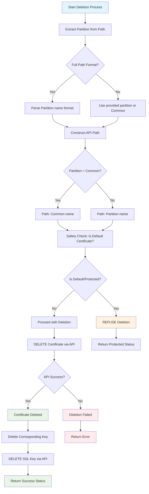

---

## 📊 Configuration Diff Generation

> To provide a complete audit trail, the script captures the F5 running configuration both before and after the cleanup. It then generates a side-by-side HTML diff report to clearly visualize all changes.

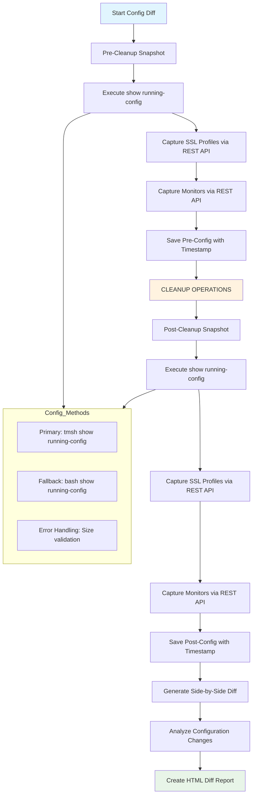

### Configuration Diff Analysis
> The script analyzes the before and after snapshots to generate a structured report detailing every change, including modified profiles, updated monitors, and deleted certificates.

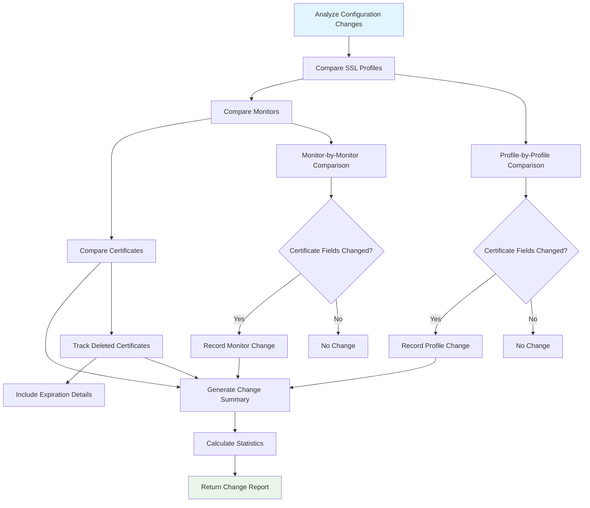

---

## 🔧 Error Handling and Resilience

> The script is designed with resilience in mind. API call failures are handled gracefully. Non-critical errors are logged as warnings, allowing the script to continue, while critical failures will halt the process to prevent an inconsistent state.

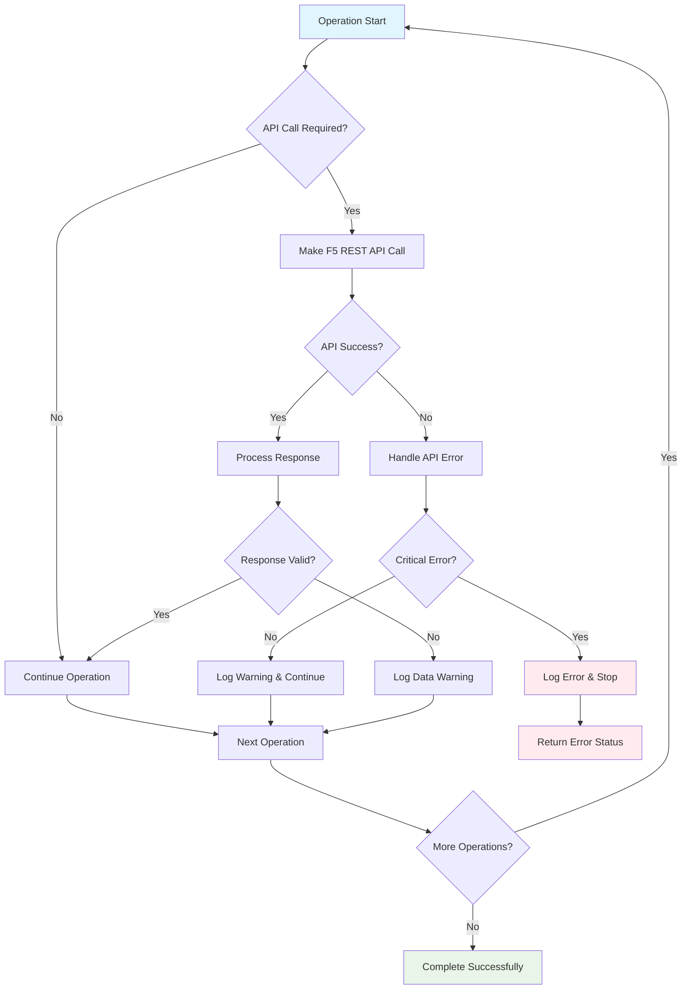

---

## 🎛️ Advanced Features

### Bulk Optimization Logic
> For performance, the bulk analysis mode significantly reduces API calls by fetching all objects of a given type from a partition at once, then checking for certificate usage in memory rather than making an API call for every certificate.

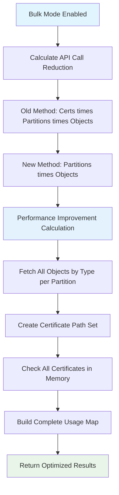

### Multi-Partition Architecture
> The script is architected from the ground up to support multi-partition F5 environments, ensuring that all operations are correctly scoped and that object paths are constructed properly for non-Common partitions.

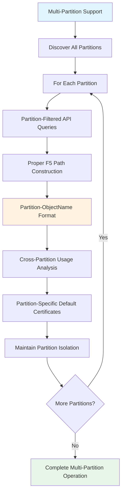

---

## 🚦 Execution Phases

The script operates in four distinct phases:

### Phase 1: Discovery and Analysis
> **Goal**: To build a complete picture of the certificate landscape without making any changes.
1.  **Connection Establishment**: TLS negotiation and authentication.
2.  **Partition Discovery**: Enumerate all administrative partitions.
3.  **Certificate Discovery**: Find all SSL certificates and keys.
4.  **Usage Analysis**: Perform comprehensive dependency checking.
5.  **Report Generation**: Create a detailed HTML analysis report.

### Phase 2: Safety Validation
> **Goal**: To ensure that the proposed cleanup is safe to execute.
1.  **Virtual Server Checks**: Verify no active services will be impacted.
2.  **GTM Object Checks**: Ensure traffic management continuity.
3.  **Default Certificate Validation**: Confirm replacement certificates exist.
4.  **User Confirmation**: Require interactive approval before making changes.

### Phase 3: Cleanup Execution
> **Goal**: To perform the certificate cleanup operations.
1.  **Pre-Cleanup Backup**: Save configuration snapshots and certificate data.
2.  **Unused Certificate Deletion**: Directly remove unused expired certificates.
3.  **Certificate Dereferencing**: Replace expired certificates in F5 objects.
4.  **Used Certificate Deletion**: Remove the now-unused certificates.
5.  **Post-Cleanup Verification**: Take a final configuration snapshot.

### Phase 4: Reporting and Audit
> **Goal**: To provide a complete and transparent audit trail of all actions taken.
1.  **Configuration Diff Generation**: Create a side-by-side before/after comparison.
2.  **Change Analysis**: Generate a structured breakdown of all modifications.
3.  **Audit Trail Creation**: Log all actions to the console and report files.
4.  **Success Metrics**: Output final statistics on completion.

---

## 💡 Key Design Principles

1.  **Safety First**: The script prioritizes preventing service impact above all else through its safety checks, user confirmation prompts, and detailed pre-action reporting.
2.  **Partition Awareness**: It correctly handles F5's partition-based architecture, ensuring accurate discovery and modification of objects in multi-tenant environments.
3.  **Comprehensive Coverage**: It scans a wide range of F5 object types that can reference certificates, including LTM, GTM, and optional modules like APM.
4.  **Performance Optimization**: Bulk API operations and intelligent caching are used to minimize API calls and reduce runtime on large F5 systems.
5.  **Detailed Auditing**: The script provides a complete audit trail through configuration backups, visual diff reports, and structured logs, ensuring full transparency.

This logic documentation provides the complete technical foundation for understanding how the F5 Certificate Cleanup script operates safely and efficiently across complex F5 environments. 