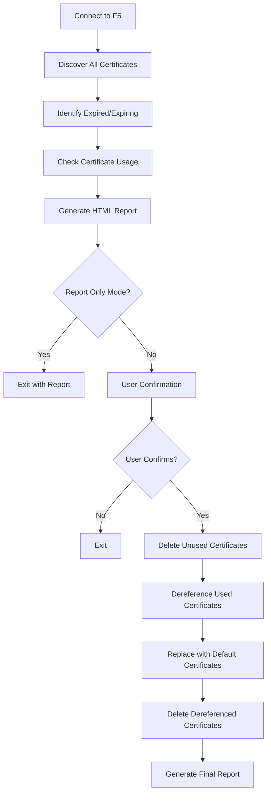

# F5 BIG-IP Certificate Cleanup Tool

## Overview

This tool automates the identification and cleanup of expired SSL certificates on F5 BIG-IP devices. It provides comprehensive analysis, safe deletion workflows, and detailed reporting.

## Performance Optimization

🚀 **Bulk Optimization Mode** (Default): The script now uses bulk optimization for certificate usage checking, dramatically improving performance when dealing with large numbers of certificates.

**Performance Comparison:**
- **100 certificates**: ~900 API calls → ~9 API calls (99% reduction)
- **200 certificates**: ~1800 API calls → ~9 API calls (99.5% reduction)

This optimization fetches all F5 objects once per partition and checks all certificates in memory, rather than making individual API calls for each certificate.

To disable optimization (for compatibility): `--disable-bulk-optimization`

## ✨ Key Features

- **🔍 Comprehensive Discovery**: Automatically discovers certificates across all F5 partitions
- **📊 Usage Analysis**: Checks certificate usage across 15+ different F5 object types
- **🚨 Service Impact Prevention**: Built-in safety checks prevent dereferencing from active Virtual Servers and GTM objects
- **🔍 Configuration Tracking**: Pre/post configuration backups with detailed diff reports for complete audit trails
- **⚡ Performance Optimized**: Bulk API operations reduce scan time by up to 95%
- **🛡️ Safety First**: Never deletes default certificates, creates backups before deletion
- **📄 Detailed Reporting**: Generates comprehensive HTML reports with actionable insights
- **🔧 Flexible Targeting**: Support for single devices or batch operations across device fleets
- **🌐 Multi-Partition Support**: Works seamlessly across all F5 administrative partitions
- **🔒 TLS Compatibility**: Intelligent TLS version negotiation for devices with different TLS requirements

## 🚨 Safety Checks: Service Impact Prevention

**NEW**: The script now includes comprehensive safety checks to prevent service disruption during certificate cleanup.

### Virtual Server Protection 🌐
Before dereferencing certificates from SSL profiles, the script:
- ✅ Discovers all Virtual Servers using the SSL profile across all partitions
- ✅ Checks each Virtual Server's enabled and availability status
- ❌ **BLOCKS** dereferencing if any Virtual Server is active
- 💡 Provides specific recommendations for maintenance windows

### GTM Object Protection 🌍
Before dereferencing certificates from GTM HTTPS monitors, the script:
- ✅ Discovers all GTM pools using the monitor (A, AAAA, CNAME, MX, NAPTR, SRV types)
- ✅ Discovers all GTM Wide IPs that reference those pools
- ✅ Checks each GTM object's enabled and availability status
- ❌ **BLOCKS** dereferencing if any GTM object is active
- 💡 Provides specific recommendations for maintenance windows

### Fail-Safe Design 🔒
- **Conservative Approach**: When in doubt, operations are blocked
- **Warning Fallback**: If status checks fail, operations proceed with warnings
- **Clear Guidance**: Specific recommendations provided when operations are blocked
- **Comprehensive Logging**: All safety check results are logged for audit

**Example Safety Check Output**:
```
🔄 Dereferencing from Client-SSL Profile: prod-ssl-profile
  🔍 Checking Virtual Servers using Client-SSL Profile: prod-ssl-profile
  📊 Found 2 Virtual Server(s) using this SSL profile
    ⚠️  Virtual Server web-app-vs is ACTIVE (enabled: True, available: True)
    ✅ Virtual Server test-vs is inactive (enabled: False, available: False)
  🛑 ABORTED: 1 active Virtual Server(s) found. Certificate dereferencing blocked.
  💡 Recommendation: Disable affected Virtual Servers during maintenance window.
```

## 🔍 Configuration Diff & Change Tracking

**NEW**: The script now includes comprehensive configuration tracking to provide a complete audit trail of all changes.

### Pre/Post Configuration Checks 📋
Before and after any cleanup operations, the script automatically:
- ✅ Captures complete F5 running configuration
- ✅ Saves configuration snapshots with timestamps
- ✅ Tracks SSL profiles, monitors, certificates, and Virtual Servers
- ✅ Generates detailed HTML diff reports showing all changes

### Configuration Diff Report 📊
The `diff_{device_ip}.html` report provides:
- **Summary Dashboard**: Overview of total changes made
- **Certificates Deleted**: Complete list with expiration details
- **SSL Profiles Modified**: Before/after comparison of certificate assignments
- **Monitors Updated**: Changes to HTTPS monitor certificate references
- **Visual Diff Display**: Color-coded before/after comparisons

### Enhanced Workflow 🔄
```
1. Certificate Analysis → 2. Pre-Config Backup → 3. User Confirmation
        ↓
4. Safety Checks → 5. Certificate Cleanup → 6. Post-Config Backup
        ↓
7. Diff Report Generation → 8. Complete Audit Trail
```

### Generated Files 📁
After cleanup completion, you'll have:
- `f5_cert_cleanup_report_{ip}.html` - Certificate cleanup report
- `config_{ip}_pre.json` - Pre-cleanup configuration backup
- `config_{ip}_post.json` - Post-cleanup configuration backup  
- `diff_{ip}.html` - **Configuration diff report**

**Example Configuration Diff Output**:
```html
📊 Summary of Changes
Total Changes: 5
Certificates Deleted: 3
SSL Profiles Updated: 2
Monitors Updated: 0

🗑️ Certificates Deleted
- /Common/expired-web-cert.crt (expired 45 days ago)
- /Common/old-api-cert.crt (expired 12 days ago)

🔧 SSL Profiles Modified  
- Client-SSL Profile: web-ssl-profile
  certKeyChain: 
    Before: [{"cert": "/Common/expired-web-cert.crt"}]
    After: [{"cert": "/Common/default.crt"}]
```

## 🚀 Quick Start

1. **Test Connection**: Verify your F5 connectivity first
   ```bash
   python test_connection.py --host 192.168.1.100 --username admin
   ```

2. **Generate Report**: Always start with a report-only scan
   ```bash
   python f5_cert_cleanup.py --host 192.168.1.100 --username admin --report-only
   ```

3. **Review Report**: Carefully examine the generated HTML report before proceeding

4. **Execute Cleanup**: Run the cleanup with safety checks enabled
   ```bash
   python f5_cert_cleanup.py --host 192.168.1.100 --username admin
   ```

## 📋 Prerequisites

- Python 3.7 or higher
- F5 BIG-IP v11.4 or higher (tested on v17)
- Network access to F5 management interface
- F5 user account with appropriate permissions:
  - Certificate management (`/sys/file/ssl-cert`)
  - Profile management (`/ltm/profile/*`)
  - Monitor management (`/ltm/monitor/*`, `/gtm/monitor/*`)

## 🛠️ Installation

1. **Clone or download the script files**:
   ```bash
   git clone <repository-url>
   cd f5-cert-logic
   ```

2. **Install required Python packages**:
   ```bash
   pip install requests urllib3
   ```

## 📖 Usage

### Single Device Mode

```bash
# Generate report only (recommended first run)
python f5_cert_cleanup.py --host 192.168.1.100 --username admin --report-only

# Full cleanup with user confirmation
python f5_cert_cleanup.py --host 192.168.1.100 --username admin

# Custom expiry threshold (45 days)
python f5_cert_cleanup.py --host mybigip.local --username admin --expiry-days 45
```

### Batch Processing Mode (Multiple Devices)

```bash
# Process multiple devices from CSV file
python f5_cert_cleanup.py --devices-csv devices.csv --username admin --report-only

# Full cleanup across multiple devices
python f5_cert_cleanup.py --devices-csv devices.csv --username admin

# Custom batch report filename
python f5_cert_cleanup.py --devices-csv devices.csv --username admin --batch-report-file batch_report.html
```

### CSV File Format

Create a `devices.csv` file with your F5 device information:

```csv
hostname,ip,username,password
bigip-prod-01,192.168.1.100,admin,
bigip-prod-02,192.168.1.101,admin,
bigip-dev-01,192.168.1.200,testuser,testpass
```

**CSV Field Requirements:**
- **hostname**: Device hostname (optional if IP provided)
- **ip**: Device IP address (optional if hostname provided)  
- **username**: Device-specific username (optional if default provided)
- **password**: Device-specific password (optional - leave empty for security)

**Note**: For security, leave password field empty in CSV and provide via command line or interactive prompt.

### TLS Configuration

```bash
# Auto mode with fallback (default - recommended)
python f5_cert_cleanup.py --host 192.168.1.100 --username admin --tls-version auto

# Legacy mode for older F5 devices
python f5_cert_cleanup.py --host old-bigip.local --username admin --tls-version legacy

# Force specific TLS version
python f5_cert_cleanup.py --host 192.168.1.100 --username admin --tls-version tlsv1_2

# Custom cipher suite for special requirements
python f5_cert_cleanup.py --host 192.168.1.100 --username admin --ciphers "HIGH:!aNULL:!MD5"

# Batch mode with TLS configuration
python f5_cert_cleanup.py --devices-csv devices.csv --username admin --tls-version legacy
```

### Automatic File Naming

The script automatically generates descriptive filenames:

```bash
# Single device - auto-generates files with device IP
python f5_cert_cleanup.py --host 192.168.1.100 --username admin
# Creates: f5_cert_cleanup_report_192_168_1_100.html
# Creates: backup_192_168_1_100.json (before deletion)

# Batch mode - auto-generates files with timestamp
python f5_cert_cleanup.py --devices-csv devices.csv --username admin
# Creates: f5_batch_cert_cleanup_report_20241215_143022.html

# Custom filenames (override auto-generation)
python f5_cert_cleanup.py --host 192.168.1.100 --username admin --report-file custom_report.html
python f5_cert_cleanup.py --devices-csv devices.csv --username admin --batch-report-file custom_batch.html
```

### Certificate Backup

Before any certificate deletion, the script automatically creates a JSON backup containing:

- **Certificate Details**: Name, expiration, subject, issuer, partition
- **SSL Key Information**: Corresponding key names and paths
- **Usage Information**: Complete list of F5 objects referencing each certificate
- **Metadata**: Timestamp, device information, script version

### Advanced Usage

```bash
# Use environment variable for password
export F5_PASSWORD="your_password"
python f5_cert_cleanup.py --host 192.168.1.100 --username admin --password "$F5_PASSWORD"

# Test TLS connectivity before cleanup
python test_connection.py --host 192.168.1.100 --username admin --tls-version legacy
```

### Command Line Options

| Option | Description | Default |
|--------|-------------|---------|
| `--host` | F5 BIG-IP hostname or IP address (single device mode) | Required* |
| `--devices-csv` | CSV file with device information (batch mode) | Required* |
| `--username` | F5 username | Required for single device |
| `--password` | F5 password (prompts if not provided) | Interactive prompt |
| `--expiry-days` | Days to consider certificates as "expiring soon" | 30 |
| `--report-only` | Generate report without performing cleanup | False |
| `--report-file` | HTML report filename (single device) | Auto-generated with device IP |
| `--batch-report-file` | HTML report filename (batch mode) | Auto-generated with timestamp |
| `--tls-version` | TLS version strategy (`auto`, `legacy`, `tlsv1_2`, etc.) | `auto` |
| `--ciphers` | Custom cipher suite string for TLS connections | None |

*Either `--host` or `--devices-csv` is required (mutually exclusive)

## 📊 Workflow

The script follows this safe workflow:



## 📄 HTML Report

The generated HTML report includes:

- **Summary Statistics**: Overview of certificate status
- **Safe Deletion List**: Expired certificates not in use
- **Dereferencing Required**: Certificates in use with usage details
- **Expiring Soon**: Certificates approaching expiration
- **Recommended Actions**: Step-by-step guidance

Example report sections:

### 🗑️ Certificates Safe for Direct Deletion
- Lists expired certificates with no references
- Shows expiration date and days expired
- Ready for immediate deletion

### ⚠️ Certificates Requiring Dereferencing
- Shows where each certificate is used
- Lists all F5 objects that reference the certificate
- Indicates which fields will be updated

## 🛡️ Safety Features

1. **Never Delete In-Use Certificates**: The script always checks for usage before deletion
2. **Default Certificate Replacement**: Replaces expired certificates with F5's built-in defaults
3. **User Confirmation Required**: Always asks for confirmation before making changes
4. **Detailed Reporting**: Shows exactly what will be changed before execution
5. **Error Handling**: Gracefully handles API errors and continues processing

## 🔧 F5 Objects Scanned

The script checks certificate usage in:

| Object Type | API Endpoint | Field Checked |
|-------------|-------------|---------------|
| Client-SSL Profile | `/mgmt/tm/ltm/profile/client-ssl` | `certKeyChain[].cert` |
| Server-SSL Profile | `/mgmt/tm/ltm/profile/server-ssl` | `cert` |
| LTM HTTPS Monitor | `/mgmt/tm/ltm/monitor/https` | `cert` |
| GTM HTTPS Monitor | `/mgmt/tm/gtm/monitor/https` | `cert` |
| OCSP Responder | `/mgmt/tm/sys/crypto/cert-validator/ocsp` | `trustedResponders` |
| APM Authentication | `/mgmt/tm/apm/profile/authentication` | `cert`, `trustedCAs` |
| LDAP Server | `/mgmt/tm/auth/ldap` | `sslCaCertFile`, `sslClientCert` |
| RADIUS Server | `/mgmt/tm/auth/radius-server` | `server.sslCaCertFile` |
| Syslog Destination | `/mgmt/tm/sys/syslog` | `remotesyslog.cert` |

## 📝 Example Output

```
🔍 Discovering SSL certificates...
✅ Connected to F5 BIG-IP: https://192.168.1.100
📋 Found 25 total certificates

🔬 Analyzing certificate usage...
  📋 Checking usage for: expired_cert_1.crt
    ✅ Not in use - safe to delete
  📋 Checking usage for: expired_cert_2.crt
    ⚠️  In use by 2 object(s)
  📋 Checking usage for: expired_cert_3.crt
    ⚠️  In use by 1 object(s) (OCSP Responder)
  📋 Checking usage for: expired_ldap_ca.crt
    ⚠️  In use by 1 object(s) (LDAP Server)

📄 Generating HTML report: f5_cert_cleanup_report_192_168_1_100.html
✅ Report saved to: /path/to/f5_cert_cleanup_report_192_168_1_100.html

📊 Cleanup Summary:
  Total certificates: 25
  Expired certificates: 4
  Expiring soon: 2
  Safe to delete: 1
  Require dereferencing: 3

🔍 Pre-cleanup configuration check...
📥 Retrieving running configuration...
✅ Running configuration retrieved successfully
💾 Running configuration saved to: config_192_168_1_100_20241215_143022.json

⚠️  This will delete 4 expired certificate(s)
   - 1 will be deleted directly
   - 3 will be dereferenced first

📥 Pre-cleanup configuration saved to: config_192_168_1_100_20241215_143022.json

❓ Do you want to proceed with the cleanup? (yes/no): yes

🧹 Starting certificate cleanup...

💾 Creating certificate backup: backup_192_168_1_100.json
✅ Certificate backup saved to: /path/to/backup_192_168_1_100.json
   📁 Backup contains 4 certificate(s) and 3 usage record(s)

🗑️  Deleting 1 unused expired certificates...
  ✅ Deleted certificate: expired_cert_1.crt

🔄 Processing 3 used expired certificates...
📋 Processing certificate: expired_cert_2.crt
  🔄 Dereferencing from Client-SSL Profile: ssl_profile_1
    ✅ Successfully dereferenced
  ✅ Deleted certificate: expired_cert_2.crt

📋 Processing certificate: expired_cert_3.crt
  🔄 Dereferencing from OCSP Responder: ocsp_validator_1
    ✅ Successfully dereferenced
  ✅ Deleted certificate: expired_cert_3.crt

📋 Processing certificate: expired_ldap_ca.crt
  🔄 Dereferencing from LDAP Server: ad_auth_server
    ✅ Successfully dereferenced
  ✅ Deleted certificate: expired_ldap_ca.crt

🔍 Post-cleanup configuration check...
📥 Retrieving running configuration...
✅ Running configuration retrieved successfully
💾 Running configuration saved to: config_192_168_1_100_20241215_143045.json

📊 Generating configuration diff report...
📄 Configuration diff report generated: diff_192_168_1_100.html

🎉 Cleanup completed!
  ✅ Deleted unused certificates: 1
  ✅ Deleted used certificates: 3
  🔑 Deleted SSL keys: 4
  🔄 Dereferenced objects: 3

📁 Generated Files:
  📄 Certificate cleanup report: f5_cert_cleanup_report_192_168_1_100.html
  📥 Pre-cleanup configuration: config_192_168_1_100_20241215_143022.json
  📤 Post-cleanup configuration: config_192_168_1_100_20241215_143045.json
  🔍 Configuration diff report: diff_192_168_1_100.html
```

### Batch Mode Example Output

```
🏢 Batch processing mode: Reading devices from CSV
📋 Loaded 3 device(s) from devices.csv

🔄 Processing 3 F5 device(s)...
================================================================================

📟 Processing device 1/3: bigip-prod-01 (192.168.1.100)
------------------------------------------------------------
✅ Connected to F5 BIG-IP: https://192.168.1.100
🔍 Discovering SSL certificates...
📋 Found 25 total certificates
🔬 Analyzing certificate usage...
  📋 Checking usage for: expired_cert_1.crt
    ✅ Not in use - safe to delete

📟 Processing device 2/3: bigip-prod-02 (192.168.1.101)
------------------------------------------------------------
✅ Connected to F5 BIG-IP: https://192.168.1.101
🔍 Discovering SSL certificates...
📋 Found 18 total certificates
🔬 Analyzing certificate usage...

📟 Processing device 3/3: bigip-dev-01 (192.168.1.200)
------------------------------------------------------------
❌ Connection failed: HTTPSConnectionPool(host='192.168.1.200', port=443)

================================================================================
📊 Batch Processing Summary:
  Total devices: 3
  Successful: 2
  Failed: 1

📄 Generating batch HTML report: f5_batch_cert_cleanup_report.html
✅ Batch report saved to: /path/to/f5_batch_cert_cleanup_report.html

🎉 Batch processing completed!
  📋 Total devices processed: 3
  ✅ Successful connections: 2
  ❌ Failed connections: 1
  🔒 Total expired certificates found: 5
  🔑 Total SSL keys found: 4
  🗑️  Total safe to delete: 3
```

## ⚠️ Important Considerations

### Before Running in Production

1. **Test in Development**: Always test the script in a non-production environment first
2. **Review the Report**: Carefully review the HTML report before confirming cleanup
3. **Backup Configuration**: Consider backing up F5 configuration before major changes
4. **Service Impact**: Understand that services using expired certificates may show SSL warnings until proper certificates are installed

### What Happens During Cleanup

1. **Unused Expired Certificates**: Deleted immediately
2. **Used Expired Certificates**: 
   - First dereferenced from all F5 objects
   - Replaced with `/Common/default.crt` and `/Common/default.key`
   - Then deleted
3. **Default Certificate**: F5's built-in default certificate is used as replacement

### Limitations

- Only processes certificates in `/Common` partition by default
- Does not handle custom certificate chains
- Default certificates may not match your domain (will cause SSL warnings)
- Does not automatically renew certificates

## 🐛 Troubleshooting

### Common Issues

**Connection Errors**:
```bash
❌ Failed to connect to F5 device: HTTPSConnectionPool(host='192.168.1.100', port=443)
```
- Check network connectivity
- Verify F5 management interface is accessible
- Confirm credentials are correct
- Try different TLS version: `--tls-version legacy` for older devices

**TLS/SSL Errors**:
```bash
[SSL: WRONG_VERSION_NUMBER] or [SSL: UNSUPPORTED_PROTOCOL]
```
- Use `--tls-version legacy` for older F5 devices (v11.x-v12.x)
- Try `--tls-version tlsv1_2` for modern devices
- Use `--ciphers "HIGH:!aNULL"` for custom cipher requirements

**Permission Errors**:
```bash
❌ Failed to check Client-SSL profiles: 401 Client Error: Unauthorized
```
- Verify user has appropriate F5 permissions
- Check if account is locked or password expired

**API Errors**:
```bash
⚠️ Warning: Could not process certificate unknown: KeyError: 'expirationDate'
```
- Some certificates may lack expiration metadata
- Script continues processing other certificates

## 📚 Additional Resources

- [Recovery Guide](RECOVERY_GUIDE.md) - Complete guide for using backup files to recover deleted certificates
- [TLS Compatibility Guide](TLS_COMPATIBILITY.md) - Comprehensive guide for TLS configuration and troubleshooting
- [Batch Processing Guide](BATCH_PROCESSING.md) - Complete guide for CSV batch processing across multiple devices
- [Certificate Usage Guide](CERTIFICATE_USAGE_GUIDE.md) - Comprehensive guide to F5 certificate usage locations
- [F5 iControl REST API Documentation](https://clouddocs.f5.com/api/bigip-tm/latest/)
- [F5 Certificate Management](https://support.f5.com/csp/knowledge-center/software/BIG-IP?module=BIG-IP%20LTM&version=17.1.0)
- [F5 DevCentral TLS Automation](https://github.com/f5devcentral/f5-tls-automation)
- [F5 APM Certificate-based Authentication](https://community.f5.com/kb/technicalarticles/migrating-f5-big-ip-apm-from-legacy-nac-service-to-compliance-retrieval-service/309398)
- [SSL Certificate Best Practices](https://support.f5.com/csp/knowledge-center/)

## 🤝 Contributing

Feel free to submit issues, feature requests, or pull requests to improve this tool.

## 📄 License

This script is provided as-is for educational and operational purposes. Test thoroughly before using in production environments.

---

**⚠️ Always review the generated HTML report carefully before proceeding with certificate cleanup!** 