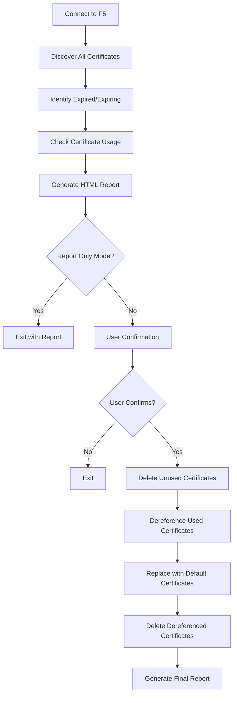

# F5 BIG-IP Certificate Cleanup Tool

A comprehensive Python script for automating the identification, analysis, and safe removal of expired SSL certificates from F5 BIG-IP devices using the iControl REST API.

## 🚀 Features

- **Smart Discovery**: Automatically identifies expired and expiring certificates
- **Comprehensive Usage Analysis**: Scans LTM/GTM profiles, monitors, APM authentication, LDAP/RADIUS servers, and system services for certificate references
- **Safety First**: Never deletes certificates that are in use without dereferencing first
- **HTML Reports**: Generates detailed pre-deletion verification reports
- **Interactive Workflow**: Requires user confirmation before making changes
- **Default Replacement**: Automatically replaces expired certificates with F5 default certificates
- **Comprehensive Logging**: Detailed logging of all operations

## 📋 Prerequisites

- Python 3.7 or higher
- F5 BIG-IP v11.4 or higher (tested on v17)
- Network access to F5 management interface
- F5 user account with appropriate permissions:
  - Certificate management (`/sys/file/ssl-cert`)
  - Profile management (`/ltm/profile/*`)
  - Monitor management (`/ltm/monitor/*`, `/gtm/monitor/*`)

## 🛠️ Installation

1. **Clone or download the script files**:
   ```bash
   git clone <repository-url>
   cd f5-cert-logic
   ```

2. **Install required Python packages**:
   ```bash
   pip install requests urllib3
   ```

## 📖 Usage

### Single Device Mode

```bash
# Generate report only (recommended first run)
python f5_cert_cleanup.py --host 192.168.1.100 --username admin --report-only

# Full cleanup with user confirmation
python f5_cert_cleanup.py --host 192.168.1.100 --username admin

# Custom expiry threshold (45 days)
python f5_cert_cleanup.py --host mybigip.local --username admin --expiry-days 45
```

### Batch Processing Mode (Multiple Devices)

```bash
# Process multiple devices from CSV file
python f5_cert_cleanup.py --devices-csv devices.csv --username admin --report-only

# Full cleanup across multiple devices
python f5_cert_cleanup.py --devices-csv devices.csv --username admin

# Custom batch report filename
python f5_cert_cleanup.py --devices-csv devices.csv --username admin --batch-report-file batch_report.html
```

### CSV File Format

Create a `devices.csv` file with your F5 device information:

```csv
hostname,ip,username,password
bigip-prod-01,192.168.1.100,admin,
bigip-prod-02,192.168.1.101,admin,
bigip-dev-01,192.168.1.200,testuser,testpass
```

**CSV Field Requirements:**
- **hostname**: Device hostname (optional if IP provided)
- **ip**: Device IP address (optional if hostname provided)  
- **username**: Device-specific username (optional if default provided)
- **password**: Device-specific password (optional - leave empty for security)

**Note**: For security, leave password field empty in CSV and provide via command line or interactive prompt.

### Advanced Usage

```bash
# Use environment variable for password
export F5_PASSWORD="your_password"
python f5_cert_cleanup.py --host 192.168.1.100 --username admin --password "$F5_PASSWORD"

# Custom report filename (single device)
python f5_cert_cleanup.py --host 192.168.1.100 --username admin --report-file my_report.html
```

### Command Line Options

| Option | Description | Default |
|--------|-------------|---------|
| `--host` | F5 BIG-IP hostname or IP address (single device mode) | Required* |
| `--devices-csv` | CSV file with device information (batch mode) | Required* |
| `--username` | F5 username | Required for single device |
| `--password` | F5 password (prompts if not provided) | Interactive prompt |
| `--expiry-days` | Days to consider certificates as "expiring soon" | 30 |
| `--report-only` | Generate report without performing cleanup | False |
| `--report-file` | HTML report filename (single device) | `f5_cert_cleanup_report.html` |
| `--batch-report-file` | HTML report filename (batch mode) | `f5_batch_cert_cleanup_report.html` |

*Either `--host` or `--devices-csv` is required (mutually exclusive)

## 📊 Workflow

The script follows this safe workflow:



## 📄 HTML Report

The generated HTML report includes:

- **Summary Statistics**: Overview of certificate status
- **Safe Deletion List**: Expired certificates not in use
- **Dereferencing Required**: Certificates in use with usage details
- **Expiring Soon**: Certificates approaching expiration
- **Recommended Actions**: Step-by-step guidance

Example report sections:

### 🗑️ Certificates Safe for Direct Deletion
- Lists expired certificates with no references
- Shows expiration date and days expired
- Ready for immediate deletion

### ⚠️ Certificates Requiring Dereferencing
- Shows where each certificate is used
- Lists all F5 objects that reference the certificate
- Indicates which fields will be updated

## 🛡️ Safety Features

1. **Never Delete In-Use Certificates**: The script always checks for usage before deletion
2. **Default Certificate Replacement**: Replaces expired certificates with F5's built-in defaults
3. **User Confirmation Required**: Always asks for confirmation before making changes
4. **Detailed Reporting**: Shows exactly what will be changed before execution
5. **Error Handling**: Gracefully handles API errors and continues processing

## 🔧 F5 Objects Scanned

The script checks certificate usage in:

| Object Type | API Endpoint | Field Checked |
|-------------|-------------|---------------|
| Client-SSL Profile | `/mgmt/tm/ltm/profile/client-ssl` | `certKeyChain[].cert` |
| Server-SSL Profile | `/mgmt/tm/ltm/profile/server-ssl` | `cert` |
| LTM HTTPS Monitor | `/mgmt/tm/ltm/monitor/https` | `cert` |
| GTM HTTPS Monitor | `/mgmt/tm/gtm/monitor/https` | `cert` |
| OCSP Responder | `/mgmt/tm/sys/crypto/cert-validator/ocsp` | `trustedResponders` |
| APM Authentication | `/mgmt/tm/apm/profile/authentication` | `cert`, `trustedCAs` |
| LDAP Server | `/mgmt/tm/auth/ldap` | `sslCaCertFile`, `sslClientCert` |
| RADIUS Server | `/mgmt/tm/auth/radius-server` | `server.sslCaCertFile` |
| Syslog Destination | `/mgmt/tm/sys/syslog` | `remotesyslog.cert` |

## 📝 Example Output

```
🔍 Discovering SSL certificates...
✅ Connected to F5 BIG-IP: https://192.168.1.100
📋 Found 25 total certificates

🔬 Analyzing certificate usage...
  📋 Checking usage for: expired_cert_1.crt
    ✅ Not in use - safe to delete
  📋 Checking usage for: expired_cert_2.crt
    ⚠️  In use by 2 object(s)
  📋 Checking usage for: expired_cert_3.crt
    ⚠️  In use by 1 object(s) (OCSP Responder)
  📋 Checking usage for: expired_ldap_ca.crt
    ⚠️  In use by 1 object(s) (LDAP Server)

📄 Generating HTML report: f5_cert_cleanup_report.html
✅ Report saved to: /path/to/f5_cert_cleanup_report.html

📊 Cleanup Summary:
  Total certificates: 25
  Expired certificates: 4
  Expiring soon: 2
  Safe to delete: 1
  Require dereferencing: 3

⚠️  This will delete 4 expired certificate(s)
   - 1 will be deleted directly
   - 3 will be dereferenced first

❓ Do you want to proceed with the cleanup? (yes/no): yes

🧹 Starting certificate cleanup...
🗑️  Deleting 1 unused expired certificates...
  ✅ Deleted certificate: expired_cert_1.crt

🔄 Processing 3 used expired certificates...
📋 Processing certificate: expired_cert_2.crt
  🔄 Dereferencing from Client-SSL Profile: ssl_profile_1
    ✅ Successfully dereferenced
  ✅ Deleted certificate: expired_cert_2.crt

📋 Processing certificate: expired_cert_3.crt
  🔄 Dereferencing from OCSP Responder: ocsp_validator_1
    ✅ Successfully dereferenced
  ✅ Deleted certificate: expired_cert_3.crt

📋 Processing certificate: expired_ldap_ca.crt
  🔄 Dereferencing from LDAP Server: ad_auth_server
    ✅ Successfully dereferenced
  ✅ Deleted certificate: expired_ldap_ca.crt

🎉 Cleanup completed!
  ✅ Deleted unused certificates: 1
  ✅ Deleted used certificates: 3
  🔄 Dereferenced objects: 3
```

### Batch Mode Example Output

```
🏢 Batch processing mode: Reading devices from CSV
📋 Loaded 3 device(s) from devices.csv

🔄 Processing 3 F5 device(s)...
================================================================================

📟 Processing device 1/3: bigip-prod-01 (192.168.1.100)
------------------------------------------------------------
✅ Connected to F5 BIG-IP: https://192.168.1.100
🔍 Discovering SSL certificates...
📋 Found 25 total certificates
🔬 Analyzing certificate usage...
  📋 Checking usage for: expired_cert_1.crt
    ✅ Not in use - safe to delete

📟 Processing device 2/3: bigip-prod-02 (192.168.1.101)
------------------------------------------------------------
✅ Connected to F5 BIG-IP: https://192.168.1.101
🔍 Discovering SSL certificates...
📋 Found 18 total certificates
🔬 Analyzing certificate usage...

📟 Processing device 3/3: bigip-dev-01 (192.168.1.200)
------------------------------------------------------------
❌ Connection failed: HTTPSConnectionPool(host='192.168.1.200', port=443)

================================================================================
📊 Batch Processing Summary:
  Total devices: 3
  Successful: 2
  Failed: 1

📄 Generating batch HTML report: f5_batch_cert_cleanup_report.html
✅ Batch report saved to: /path/to/f5_batch_cert_cleanup_report.html

🎉 Batch processing completed!
  📋 Total devices processed: 3
  ✅ Successful connections: 2
  ❌ Failed connections: 1
  🔒 Total expired certificates found: 5
  🗑️  Total safe to delete: 3
```

## ⚠️ Important Considerations

### Before Running in Production

1. **Test in Development**: Always test the script in a non-production environment first
2. **Review the Report**: Carefully review the HTML report before confirming cleanup
3. **Backup Configuration**: Consider backing up F5 configuration before major changes
4. **Service Impact**: Understand that services using expired certificates may show SSL warnings until proper certificates are installed

### What Happens During Cleanup

1. **Unused Expired Certificates**: Deleted immediately
2. **Used Expired Certificates**: 
   - First dereferenced from all F5 objects
   - Replaced with `/Common/default.crt` and `/Common/default.key`
   - Then deleted
3. **Default Certificate**: F5's built-in default certificate is used as replacement

### Limitations

- Only processes certificates in `/Common` partition by default
- Does not handle custom certificate chains
- Default certificates may not match your domain (will cause SSL warnings)
- Does not automatically renew certificates

## 🐛 Troubleshooting

### Common Issues

**Connection Errors**:
```bash
❌ Failed to connect to F5 device: HTTPSConnectionPool(host='192.168.1.100', port=443)
```
- Check network connectivity
- Verify F5 management interface is accessible
- Confirm credentials are correct

**Permission Errors**:
```bash
❌ Failed to check Client-SSL profiles: 401 Client Error: Unauthorized
```
- Verify user has appropriate F5 permissions
- Check if account is locked or password expired

**API Errors**:
```bash
⚠️ Warning: Could not process certificate unknown: KeyError: 'expirationDate'
```
- Some certificates may lack expiration metadata
- Script continues processing other certificates

## 📚 Additional Resources

- [Batch Processing Guide](BATCH_PROCESSING.md) - Complete guide for CSV batch processing across multiple devices
- [Certificate Usage Guide](CERTIFICATE_USAGE_GUIDE.md) - Comprehensive guide to F5 certificate usage locations
- [F5 iControl REST API Documentation](https://clouddocs.f5.com/api/bigip-tm/latest/)
- [F5 Certificate Management](https://support.f5.com/csp/knowledge-center/software/BIG-IP?module=BIG-IP%20LTM&version=17.1.0)
- [F5 APM Certificate-based Authentication](https://community.f5.com/kb/technicalarticles/migrating-f5-big-ip-apm-from-legacy-nac-service-to-compliance-retrieval-service/309398)
- [SSL Certificate Best Practices](https://support.f5.com/csp/knowledge-center/)

## 🤝 Contributing

Feel free to submit issues, feature requests, or pull requests to improve this tool.

## 📄 License

This script is provided as-is for educational and operational purposes. Test thoroughly before using in production environments.

---

**⚠️ Always review the generated HTML report carefully before proceeding with certificate cleanup!** 